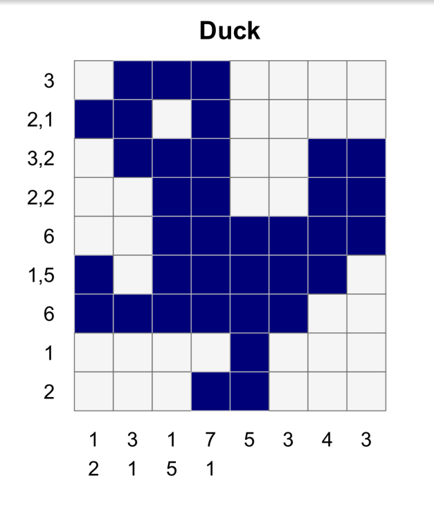

# Nonogram_solver

Python script solving nonograms.

## How to use

Save configuration in the input.txt file (example file contains configuration for this nonogram):



Configuration schema:

```bash
<number of rows> <number of columns>
<row1>
<row2>
...
<col1>
<col2>
...
```

Solution will be written to output.txt file.
